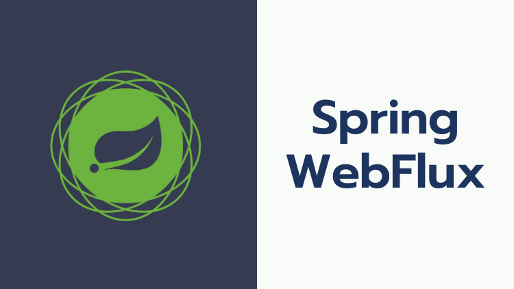

# Reactive Microservices With Spring WebFlux

This repoistory contains the source code for [**Spring Webflux**](https://www.udemy.com/course/spring-webflux/) course on Udemy.

## Course Focus

This course provides a comprehensive introduction to Spring WebFlux, a framework for building highly scalable, resilient and responsive web applications using reactive programming principles.

## What You'll Learn

- **Traditional vs Reactive APIs**
    - How Reactive APIs are different from Traditional APIs.
- **Reactive Data Access R2DBC**
    - Learn to connect to relational databases reactively using R2DBC drivers, create reactive repositories with Spring Data R2DBC, implement CRUD operations with reactive data access patterns, and effectively integration test your data access layer.
    - Running a throughput/efficiency test to demonstrate the power of R2DBC, its throughput and how it uses the system resources more efficiently compared to Spring Data JPA.
- **Building CRUD Operations**
    - Master creating reactive controllers with Spring WebFlux annotations, handling requests and responses with Flux and Mono, integration testing your reactive controllers.
- **Error Handling Strategies**
    - Discover techniques for managing exceptions within reactive pipelines using various operators. Learn how to return meaningful error responses for a robust user experience.
- **WebFilter/Interceptor Chaining** 
    - Explore how to implement WebFilters for pre-processing and post-processing requests and responses. Chain multiple WebFilters for complex logic, pass attributes from WebFilters to controllers, and share data effectively.
- **Functional Programming with WebFlux**
    - Leverage the power of lambda expressions to write concise and readable code. Build reactive controllers with functional endpoints and understand the benefits of functional programming within WebFlux.
- **Building Reactive Clients**
    - Learn to use WebClient to build reactive clients that consume external APIs using reactive streams and handle asynchronous responses efficiently in a non-blocking manner.
- **Streaming**
    - Implement client-side streaming for uploading data as a stream using WebClient and explore backpressure handling for optimized data transfer.
    - Implement server-side streaming for downloading data as a stream using WebClient.
    - Implement Server-Sent Events (SSE) with Spring WebFlux to enable real-time data updates from server to client.
- **Optimizing for Performance**
    - Gzip compression
    - HTTP connection pooling to optimize bandwidth usage and application scalability.
    - **Leveraging HTTP/2 protocol for efficient communication (New!)**.

## Integration Testing    
Master integration testing with WebTestClient, combining testing practices into our learning process throughout the course.

## Course Structure

- Focus on practical code examples and demos tailored to each module's specific topic.
- Hands-on labs to solidify your learning throughout the course.
- Access to resources for further learning on both Spring WebFlux and prerequisite reactive programming concepts (articles, tutorials, official documentation).

By the end of this course, you'll be equipped with the knowledge and skills to build modern, performant, and scalable web applications using Spring WebFlux.

**Note**

A basic understanding of reactive programming is assumed as a prerequisite for this course.